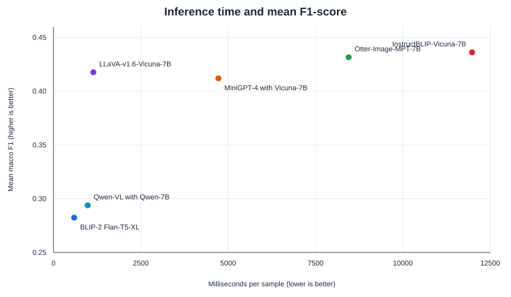

# Lightweight VLM-FakeNews Benchmark

[](LICENSE)
[](pyproject.toml)

This repository provides a cleaned, unified zero-shot evaluation pipeline for six lightweight vision-language models on five multimodal fake-news benchmarks. It implements the paper's prompt, response-to-label mapping, macro classification metrics, and per-sample inference-time protocol while keeping datasets and third-party model implementations outside the codebase. The implementation was modularized from the experimental working code; it is not a frozen copy of every original environment or prediction artifact.

<p align="center">
  
</p>

## What is included

- Adapters for LLaVA-v1.6-Vicuna-7B, Qwen-VL with Qwen-7B, Otter-Image-MPT-7B, MiniGPT-4 with Vicuna-7B, BLIP-2 Flan-T5-XL, and InstructBLIP-Vicuna-7B.
- MMFakeBench-compatible dataset loading with schema and image-path validation.
- A single prompt and deterministic label parser shared by every run.
- Fixed-class macro precision, recall, and F1, plus class-level metrics and invalid-output reporting.
- GPU-synchronized latency measurement over 100 samples, excluding model loading.
- Machine-readable values from the paper in [`results/`](results/).
- Tests and continuous integration for all dependency-free evaluation logic.

## Paper results

No model reached an F1-score above 0.55 on any dataset. The best model varied by benchmark: MiniGPT-4 on Fakeddit and Weibo, InstructBLIP on IFND, LLaVA on MMFakeBench, and OTTER on DriftBench.

| Model | Fakeddit | IFND | MMFakeBench | Weibo | DriftBench | ms/sample |
|---|---:|---:|---:|---:|---:|---:|
| LLaVA-v1.6-Vicuna-7B | 0.404 | 0.426 | **0.514** | 0.479 | 0.265 | 1,142 |
| Qwen-VL with Qwen-7B | 0.326 | 0.273 | 0.415 | 0.352 | 0.103 | 980 |
| Otter-Image-MPT-7B | 0.436 | 0.530 | 0.307 | 0.381 | **0.504** | 8,449 |
| MiniGPT-4 with Vicuna-7B | **0.466** | 0.378 | 0.441 | **0.547** | 0.228 | 4,719 |
| BLIP-2 Flan-T5-XL | 0.308 | 0.250 | 0.412 | 0.340 | 0.102 | **592** |
| InstructBLIP-Vicuna-7B | 0.409 | **0.548** | 0.278 | 0.457 | 0.489 | 11,982 |

Values are macro F1-scores on the test splits. Latency is the mean over 100 image-text samples with batch size 1. The complete precision/recall/F1 table is in [`paper_classification_metrics.csv`](results/paper_classification_metrics.csv). These CSVs transcribe the manuscript tables; see [`results/README.md`](results/README.md) for their provenance and limitations.

## Installation

The evaluation and reporting tools have no runtime dependencies. After cloning this repository:

```bash
cd LiteVLM-FakeNews-Benchmark
python -m venv .venv
source .venv/bin/activate
python -m pip install --upgrade pip
python -m pip install -e .
```

For inference, install the shared packages and then follow the official setup for the selected model listed in [`configs/models.json`](configs/models.json):

```bash
python -m pip install -e ".[inference]"
```

Use a separate environment per model because upstream VLM repositories require different dependency versions. Model weights download from their original providers and remain governed by their licenses.

Hugging Face checkpoint revisions and recommended upstream source snapshots for this release are recorded in [`configs/models.json`](configs/models.json). They make new release runs inspectable, but the original exploratory environments did not record every upstream commit; therefore, this repository supports protocol-level reruns rather than bit-for-bit reconstruction of the paper environment. Qwen-VL requires `trust_remote_code=True`; review its pinned code revision before running it. Use `--revision` only when deliberately testing another immutable revision.

## Dataset preparation

Datasets are not bundled. [`docs/DATASETS.md`](docs/DATASETS.md) links each primary source and records the exact split counts, label mappings, and annotation SHA-256 digests. Follow each provider's access and licensing terms. Annotations use this JSON shape:

```json
[
  {
    "text": "A news caption",
    "image_path": "/images/example.png",
    "gt_answers": "Fake",
    "fake_cls": "mismatch"
  }
]
```

Validate each split before a run:

```bash
litevlm-fnd validate-data \
  --annotations /datasets/MMFakeBench_test/source/MMFakeBench_test.json \
  --data-root /datasets/MMFakeBench_test
```

See [`data/README.md`](data/README.md) for field semantics.

## Run an experiment

```bash
litevlm-fnd run \
  --model blip2-flan-t5-xl \
  --annotations /datasets/MMFakeBench_test/source/MMFakeBench_test.json \
  --data-root /datasets/MMFakeBench_test \
  --output-dir outputs/blip2/MMFakeBench_test
```

Supported `--model` values are:

```text
blip2-flan-t5-xl
instructblip-vicuna-7b
llava-v1.6-vicuna-7b
minigpt4-vicuna-7b
otter-image-mpt-7b
qwen-vl-qwen-7b
```

MiniGPT-4 requires `--model-path` for its official evaluation YAML and `--repo-path` for its checkout. InstructBLIP requires `--repo-path` for LAVIS. All runs default to seed 42, batch size 1, and 100 timed samples.

To evaluate previously generated predictions without loading a model:

```bash
litevlm-fnd evaluate --predictions outputs/blip2/MMFakeBench_test/predictions.json
```

The full experiment contract, output format, and regeneration commands are in [`docs/REPRODUCIBILITY.md`](docs/REPRODUCIBILITY.md).

## Repository layout

```text
LiteVLM-FakeNews-Benchmark/
├── configs/          # model identifiers and upstream repositories
├── data/             # dataset schema (datasets are not committed)
├── docs/             # reproducibility protocol
├── results/          # paper metrics and latency values
├── scripts/          # deterministic paper-asset generation
├── src/              # installable evaluation and inference package
└── tests/            # parser, metrics, and dataset tests
```

## Citation

If this repository supports your research, cite the paper using [`CITATION.cff`](CITATION.cff). A BibTeX entry is also provided in [`CITATION.bib`](CITATION.bib).

## Acknowledgements

The shared decision prompt and compatible annotation structure build on [MMFakeBench](https://github.com/liuxuannan/MMFakeBench). Model adapters use the respective official LLaVA, Qwen-VL, OTTER, MiniGPT-4, BLIP-2/LAVIS, and InstructBLIP/LAVIS implementations. This repository does not redistribute their code, checkpoints, or datasets.

## License

Original software in this repository is released under the [MIT License](LICENSE). The adapted MMFakeBench prompt and protocol elements are attributed in [`NOTICE`](NOTICE) and remain under CC BY 4.0. Third-party models and datasets retain their own licenses and terms of use.
