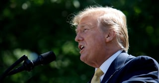
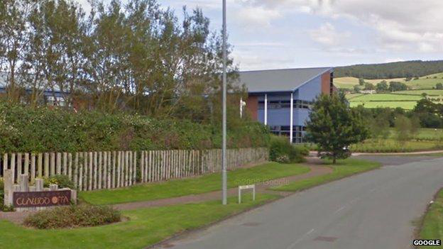
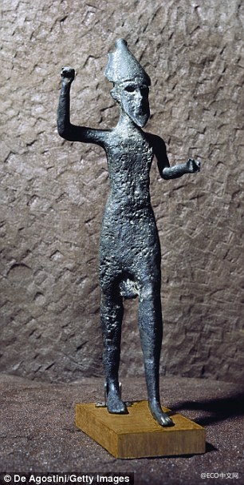
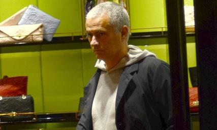

# Supplementary Evaluation Results

This page provides additional results and analysis that could not be included
in the paper due to the page limit.

## 1. Fallback Rates

The fallback rate is the percentage of model outputs that could not be matched
to a valid label and were handled using the predefined fallback rule.

| Model | Fakeddit | IFND | MMFakeBench | Weibo | DriftBench |
|---|---:|---:|---:|---:|---:|
| BLIP-2 Flan-T5-XL | 0.00% | 0.00% | 0.00% | 0.00% | 0.00% |
| InstructBLIP-Vicuna-7B | 12.84% | 12.55% | 11.31% | 24.63% | 10.37% |
| LLaVA-v1.6-Vicuna-7B | 0.00% | 0.00% | 0.00% | 0.00% | 0.00% |
| MiniGPT-4 with Vicuna-7B | 11.02% | 11.30% | 11.06% | 24.39% | 10.17% |
| OTTER-Image-MPT-7B | 10.43% | 14.04% | 16.84% | 24.71% | 16.93% |
| Qwen-VL with Qwen-7B | 0.00% | 0.00% | 0.00% | 0.00% | 0.00% |

Fallback usage varies across models and datasets.

## 2. Baseline Literature Evidence

Recent multimodal misinformation studies commonly use LLaVA as an
evaluation model, baseline, or model backbone. Based on this literature,
LLaVA-v1.6-Vicuna-7B is used as the reference baseline in our comparison.

| Study | Venue / Year | Use of LLaVA |
|---|---|---|
| Tahmasebi et al., *Multimodal Misinformation Detection using Large Vision-Language Models* | CIKM 2024 | Evaluates LLaVA for multimodal misinformation detection |
| Liu et al., *MMFakeBench* | ICLR 2025 | Evaluates LLaVA-1.6 together with several other LVLMs as benchmark models |
| Pendyala and Chintalapati, *Using Multimodal Foundation Models for Detecting Fake Images on the Internet with Explanations* | Future Internet 2024 | Compares LLaVA with CLIP, Moondream2, and Gemini for fake-image detection |
| *TRUST-VL* | EMNLP 2025 | Includes LLaVA-v1.5 and LLaVA-v1.6 checkpoints among the VLM baselines |
| *VLDBench* | Information Fusion 2026 | Uses LLaVA-v1.5-Vicuna-7B as a benchmark VLM for multimodal disinformation detection |
| *SparseMoE-MFN* | CMC 2026 | Uses LLaVA-v1.6-Mistral-7B-HF as the visual-language encoder |
## 3. Qualitative Failure Examples

Representative incorrect predictions from OTTER-Image-MPT-7B are shown below.

### Fakeddit

**Caption:** believers hezbollah.  
**Ground Truth:** Fake  
**Prediction:** True  
**Model Output:** The image has a captioned news of believers Hezbollah, but the caption does not match the image, and there is no image refuting it.

---

### IFND

**Caption:** In Delhi, Deputy US Secretary of State Stephen Biegun pitches for Pax Indo-Pacifica.  
**Ground Truth:** True  
**Prediction:** Fake  
**Model Output:** Finish [MISMATCH].

---

### MMFakeBench

**Caption:** The new factory could be built at Offa s Dyke Business Park in Welshpool.  
**Ground Truth:** True  
**Prediction:** Fake  
**Model Output:** Finish-Mismatch.

---

### Weibo

**Caption:** 【每日美图】西西里的希腊古城塞利侬特（Selinunte）.  
**Ground Truth:** True  
**Prediction:** Fake  
**Model Output:** Finish(MISMATCH).

---

### DriftBench

**Caption:** Jose Mourinho in Shanghai last week.  
**Ground Truth:** True  
**Prediction:** Fake  
**Model Output:** Finish[Mismatch].

